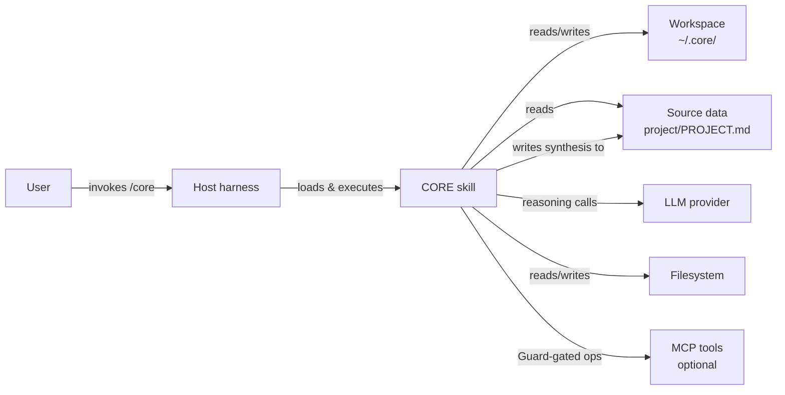

# CORE Architecture

## What This Document Is

CORE (Continuous Omni-Reasoning Engine) is a multi-agent adversarial reasoning framework. It runs as a skill loaded into a compatible agent harness; you invoke it with `/core` to coordinate specialized agent swarms through structured adversarial loops. A single, persistent Delivery Manager (DM) orchestrates the swarms and produces outputs that survive challenge before reaching the user.

This document is the architecture reference. For value proposition and installation, see [README.md](README.md). For operational guidance inside a session (how the DM actually behaves turn-to-turn), see `SKILL.md` inside the installed skill.

**Intended audience.** Contributors extending the framework. Technical evaluators deciding whether to adopt it. Integrators embedding it in larger systems. Security reviewers auditing it. Researchers interested in the design choices.

**Editorial convention.** Principle Statement-italic lines (§2) and section openers throughout this document use imperative or modal voice. Passive-copula construction ("X is Y") is reserved for §12 Glossary entries and explicit labeled-definition rows (the §9.4 schema row, ADR Context/Decision/Consequence rows where Consequences report effects rather than assert qualities). The convention is a meta-posture parallel to *Behavioral honesty* in §2.3: where one governs content disclosure, the other governs verb form. Both exist to keep this document from drifting toward pitch voice. See `references/voice-discipline.md` for the V-class vocabulary and the structural-habit catalog the convention emerged from.

---

## 1. Introduction & Goals

### Quality goals

In priority order: **Accuracy > Transparency > User Control > Adversarial Rigor.** Performance and cost efficiency are explicit secondary goals; determinism is a non-goal — CORE is inference-based and variation is inherent. Behavioral honesty is a meta-posture that applies across all principles rather than ranking among them — see §2 for the elaboration. The principles in §2 frame each quality as an exploitable property of agentic AI; the priority sub-table at the end of §2 maps each quality back to its realizing principles.

### Stakeholders

| Stakeholder | Primary concerns |
|---|---|
| User | Accuracy, transparency, continuity across sessions, retention of their intent |
| Contributor | Extension points, invariants, clear boundaries for PRs |
| Evaluator | Trade-offs, honest failure modes, survival-under-challenge |
| Integrator | Stable interfaces, configuration surface, output schema stability |
| Security reviewer | Trust boundaries, data flow, destructive-op gating |

---

## 2. Principles

The properties below fall into two categories: the native characteristics of inference-based multi-agent systems with current-generation models (§2.1), and the disciplines that turn those characteristics into trustworthy output (§2.2).

**Vocabulary used in this section.** **DM** (Delivery Manager) is the persistent orchestrator that runs through every CORE session. **Generator**, **Critic**, **Monitor**, **Synthesizer**, and **Guard** are role names for agents the DM spawns into a swarm. **PROJECT.md** is the user-controlled project synthesis at the project root. **Dream cycle** is the periodic memory-curation phase. Full definitions live in §12 Glossary.

Each principle is presented as a *Statement* (italic), an **Intention** that frames it as an exploitable property of agentic AI as a class, and where applicable an **In CORE** note showing how this framework specifically embodies it. Read the principles for the property; read the In CORE notes for one concrete example of designing on top of that property.

**On the In CORE notes.** Where a principle's *Intention* itself contains the obvious embodiment, no separate **In CORE** note is given — naming a redundant example would dilute the property. Where the embodiment is non-obvious or load-bearing for CORE's invariants, the note is included. The asymmetry is intentional, not unfinished.

References elsewhere in this document use the principle number (P1–P12) — names may evolve, numbers are stable.

### 2.1 Native characteristics of agentic AI (1–4)

Principles 1–4 describe properties present in inference-based multi-agent systems running on current-generation models. The properties are exploitable: build patterns on top of them.

#### Principle 1: Accessible

*The framework can be reached through natural-language conversation.*

**Intention.** Tools used to require learning the tool. With agentic AI, you reach capability the way you already think — by saying what you want. This collapses the barrier between intent and action: the moment you can articulate what you need, the system can attempt it. Patterns built on this property remove the translation steps users used to spend their attention on.

#### Principle 2: Inference-First

*Every framework decision can be produced through reasoning over context — no hardcoded rules, scripted workflows, or compiled decision logic.*

**Intention.** What you can describe is what the system can attempt — even if no one pre-specified it. The system is as capable as the model it runs on; gains in the base model translate directly into gains in your patterns. Variability is the cost; the trade is worth taking because what cannot be pre-specified can still be discovered. Patterns built on this property avoid the trap of pre-coded workflows that age out of relevance.

**In CORE.** `protocols/`, `agents/`, `templates/` are 100% inference markdown. No executable code encoding decisions.

#### Principle 3: Specialized

*Domain expertise can be supplied by the LLM and composed at runtime from named agent identities.*

**Intention.** Your reach extends to whatever specialization the model carries — security, design, finance, biology — without pre-installing skills. New domains become available the moment the model gets better at them. P3 is *power per agent*: the depth a single specialist perspective can reach. Patterns built on this property let you spawn specialist perspectives on demand instead of architecting them in advance.

#### Principle 4: Multi-Agent

*Work decomposes across multiple agents working in parallel and recomposes through coordination.*

**Intention.** A single agent is one perspective. Multiple agents allow division of labor, parallel exploration, and structured disagreement. Force multiplier limited by hardware and imagination, not by serialization. P4 is *power across agents*: the lever P3 specialization gets multiplied through. Patterns built on this property scale through coordination instead of through sequential effort.

**In CORE.** Generator/Critic/Monitor/Synthesizer is the canonical multi-agent shape. Each role brings a different lens; the cross-pollination phase exposes their disagreements before synthesis.

### 2.2 Quality practices (5–12)

Principles 5–12 describe disciplines that turn the §2.1 properties into trustworthy output. Apply them when correctness matters more than completion.

#### Principle 5: Agnostic

*Choose representations and integrations that survive vendor changes — human-readable markdown end-to-end, decoupled from any specific harness or LLM provider.*

**Intention.** The discipline that makes the investment portable is choosing surfaces that don't bind to a single runtime. As an exploitable property: pick representations that stay legible across migrations, and decouple your patterns from the specific harness or model provider. Patterns that ignore this lock you into one vendor; patterns that exploit it compound across runtimes rather than re-implementing on each platform.

**In CORE.** All protocols, agent definitions, schemas, and templates are markdown. The skill installs into any compatible harness without modification.

#### Principle 6: User Authority

*Agentic AI can be configured to defer to humans on any decision the user chooses to retain.*

**Intention.** As an exploitable property: you choose where to hold the veto — high-stakes outputs, irreversible actions, anything you don't want on autopilot. The reach of agentic AI is the reach you authorize. Patterns that ignore this drift toward opaque automation; patterns that exploit it become trustworthy at any scale.

**In CORE.** `PROJECT.md` is the sole authoritative read surface for project facts — delete a fact there and the DM no longer has it at next bootstrap. Destructive external operations (MCP writes, file deletions) are Guard-gated; never pre-approved.

#### Principle 7: Adversarial Reasoning

*Findings can be made to survive structured challenge before reaching the user. Teams can be composed to disagree.*

**Intention.** Single-pass LLM output has a measured 84.5% sycophancy flip rate[^1]; multi-agent setups can compound this when agents share priors — a 9-point homogeneity gap between isolated and cross-pollinated analysis[^1]. As an exploitable property: compose teams to disagree, *and ensure the perspectives are genuinely independent* — different domains, different framings, different anchors. Heterogeneity is the lever; adversarial structure built on homogeneous agents inherits the homogeneity gap. Generator/Critic/Monitor/Synthesizer is one shape; any pattern that builds in opposing forces and varies their analytical lenses gets the same benefit. Patterns that don't exploit adversarial structure inherit the sycophancy by default.

**In CORE.** Critic builds an independent frame before seeing Generator output (anti-anchoring). Deep Audit gate: three named failure modes before any approval. Persuasion Log + Mind Changes fields populated in every output, or the process is presumed broken.

#### Principle 8: Iterative

*Outputs can be produced through multiple passes — re-synthesis, intent re-checks, context refocusing — when current LLMs drift, anchor, or saturate over the course of a single attempt.*

**Intention.** Today's models produce their best work when context gets re-grounded, when original intent gets re-checked against drift, and when synthesis happens in passes rather than one shot. As an exploitable property: design your patterns to iterate explicitly — re-read your goal, re-synthesize against current state, loop the same problem with a fresh frame. This is a present-state premise, not a permanent claim — future models may need fewer passes. Until then, iteration is how high quality is reached, not a sign that something failed.

#### Principle 9: Emergent

*Agent personas, traits, and team configurations can be made to emerge from inference rather than pre-design.*

**Intention.** Pre-specified persona libraries become wrong as the work changes. As an exploitable property: let inference compose the team for the problem at hand, then keep what worked. The framework's vocabulary grows itself. P9 is the *origination* side of the framework's adaptability; P10 is the *retention* side that decides what to keep. Patterns that fix the persona roster up front lose this adaptation; patterns that grow it earn compounding fitness for the actual work.

**In CORE.** Agent identities emerge through composition during swarm execution — the DM creates agents purpose-built for each task. Effective compositions surface during runtime; only those that prove their value get saved into `~/.core/agents/` for future reuse, and underperforming ones are retired during dream cycles.

#### Principle 10: Self-Improving

*Agentic systems can audit their own behavior, retire what doesn't work, and reinforce what does.*

**Intention.** Patterns that don't audit themselves accumulate noise — the loop drifts, configurations stale, contradictions in memory go unresolved, and the system optimizes for an obsolete shape. As an exploitable property: build the audit into the loop instead of after-the-fact, and consume the system's own artifacts as evidence — what got saved, what got reused, what got contradicted, what got retired. P10 closes the loop P9 opens: emergence produces variants, self-improvement keeps the ones that work. Improvement is bounded by accept/reject discipline, observable in artifacts, and never destabilizing.

**In CORE.** Dream cycles run every 3–5 sessions and audit (a) memory for stale or contradictory entries, (b) recent agent identities for effectiveness, (c) prior improvement claims for actual deployment.

#### Principle 11: Context Persistence

*Project knowledge can be persisted across sessions in a layered memory architecture.*

**Intention.** Long-running work unfolds over weeks and months. As an exploitable property: choose what survives across sessions, where it lives, and who controls it. The location decides who can edit a fact and how much weight it carries — a decision in a user-controlled file is harder to lose than a session note. The lifecycle decides when staleness gets reconciled — every-session reconciliation catches drift early; never reconciling lets old assumptions drive current decisions. Patterns that persist context thoughtfully pick up where they left off; patterns that don't restart at zero every time.

**In CORE.** Three surfaces. `PROJECT.md` is the user-controlled record of project facts; `~/.core/` holds DM operational meta across projects; auto-memory is a session-scoped scratch cache rebuilt from `PROJECT.md` at each session start. Deletions from `PROJECT.md` propagate to next-session knowledge; mid-session memory may briefly retain a deleted fact until the next reconciliation, and that residual is disclosed rather than hidden.

#### Principle 12: Transparency

*Every agent-to-agent message and every step of agent reasoning can be made visible to the user in real time.*

**Intention.** Agentic AI is most valuable when its reasoning is auditable — opacity defeats the trust that makes delegation possible. As an exploitable property: surface what the agents are saying to each other and how they reached their positions, in real time, so the user is judging actual reasoning rather than receiving a verdict. Transparency actively constrains design — ergonomic patterns that hide reasoning (background agents, tool-call-only intra-swarm messaging, silent synthesis) trade audit for speed, and that trade should be made consciously.

**In CORE.** The primary inter-agent channel is the user-visible event stream; tool-mediated state changes are logged to the same audit trail. The DM narrates key moments — concessions, convergence signals, loops heating up. Hidden reasoning is treated as a bug, not an optimization.

### 2.3 Quality priorities

The principles compose into ranked qualities. When two principles point in different directions, this priority order resolves the conflict. Within the Primary tier, qualities are ordered as in §1: Accuracy > Transparency > User Control > Adversarial Rigor.

| Priority | Quality | Realized by |
|---|---|---|
| Primary | Accuracy | P7 Adversarial Reasoning, P8 Iterative |
| Primary | Transparency | P12 Transparency |
| Primary | User control | P6 User Authority, P11 Context Persistence |
| Primary | Adversarial rigor | P7 Adversarial Reasoning, P8 Iterative, P4 Multi-Agent |
| Secondary | Performance | Explicitly deprioritized when in conflict with accuracy |
| Secondary | Cost efficiency | Explicitly deprioritized when in conflict with accuracy |
| Non-goal | Determinism | P2 Inference-First makes variation inherent |

**Behavioral honesty.** Across every principle in this section, where an invariant has a residual — in-session memory, model drift, partial implementation, aspirational capability — the residual is named here, disclosed in artifacts, not absorbed silently. This is a meta-posture that applies across the principles rather than a sibling principle: the §2.1 framing claim that properties are "characteristic of inference-based multi-agent systems with current-generation models" is itself a residual disclosure (current generation, not all generations); §11 Risks names the prompt-cache residual to the user-control invariant; aspirational capability areas are labeled as such in §6.2. The honesty about what isn't yet true is what makes the claims about what is true credible.

The 84.5% sycophancy flip rate and 9-point homogeneity gap[^1] measured in naive multi-agent deployments are the failure modes the priority order above is designed to avoid. They justify the cost of the adversarial loop.

[^1]: Source — CORE independent analysis, Session 12 (2026-03-27). The 84.5% sycophancy flip rate corroborates published research on LLM sycophancy; the 9-point homogeneity gap is CORE-specific empirical data from controlled isolated-vs-cross-pollinated multi-agent runs. Both numbers are subject to model-version drift; current-generation models may produce different baselines. Full analysis archived in the CORE project repository (Session 12 outputs).

---

## 3. Constraints

- **Hosted inside a harness.** CORE does not run as a standalone service. It is a skill loaded into a host harness that provides the event loop, tool routing, user interface, and sub-agent spawning primitives. CORE owns the orchestration protocol.
- **Inference-based, not rule-based.** No compiled decision engine, no scripted workflow interpreter, no hardcoded playbook. Every decision — team composition, strategy selection, result assessment — is produced through reasoning over context. The system is as capable as the model it runs on and as good as the context the user provides.
- **High-capability LLM required.** Multi-agent adversarial loops place non-trivial demands on context window, tool use, and extended thinking. Smaller or faster models yield degraded output with no automatic detection.
- **Three-surface persistence.** Project facts live in `<project>/PROJECT.md` (user-controlled). DM operational meta lives in `~/.core/` (skill-controlled, cross-project). Auto-memory is a reconciling scratch cache rebuilt from PROJECT.md at each bootstrap. This division is architectural — see §9.
- **Guard-gated destructive operations.** Any create/update/delete on external systems (MCP tools, task trackers, chat platforms) requires a Guard agent or explicit user approval. Never pre-approved.
- **Hardware floor.** Sub-skill adaptive-swarm tiers scale with available RAM. Systems below 24 GB are constrained to Lightweight tier per the `/core-analysis` complexity-assessment protocol.

---

## 4. Context & Scope

### System context diagram



### External actors

| Actor | Role | Direction of trust |
|---|---|---|
| **User** | Final authority on all outputs and persistence | Trusted |
| **Harness** | Hosts execution; routes tools and messages | Trusted (but its surface area is the attack surface) |
| **LLM provider** | Supplies the reasoning | Trusted (by contract) |
| **Source data** | The project CORE analyzes | Read-authoritative; written only to `PROJECT.md` with user approval |
| **Filesystem** | Durable storage for the three persistence surfaces | Trusted local |
| **Optional MCP tools** | External systems the user has connected (calendars, task trackers, cloud storage) | Access is Guard-gated; never auto-approved for writes |

### In scope

Multi-agent orchestration. Persistent memory across the project lifespan. Self-evolution: dream cycles run every 3–5 sessions and update the agent roster and memory based on what worked. Between cycles, the skill does not modify itself; skill-instruction changes follow a separate user-approved path. Adversarial challenge of the framework's own outputs. Integration with harness-provided tools. Portability across compatible harnesses.

### Explicit non-goals

- **Not a central service.** No shared server, no cross-user data pooling, no remote callbacks. All synthesized data stays on the user's machine.
- **Not an autonomous decision-maker.** CORE prepares the user for decisions. It does not decide on the user's behalf.
- **Not a rule engine.** No hardcoded workflows, no scripted playbooks. If a behavior cannot be expressed as reasoning over context, CORE does not do it.
- **Not a replacement for domain expertise.** CORE assembles and challenges perspectives. It does not substitute for the subject-matter knowledge the user brings.
- **Not model-agnostic in quality.** CORE's loops assume capable reasoning. Small or fast models produce degraded output; there is no automatic detection of this degradation.
- **Not a one-shot tool.** CORE's value compounds across sessions. Single-invocation usage captures a fraction of the benefit.

---

## 5. Strategy

The principles in §2 compose into three load-bearing strategies the rest of this document elaborates.

**Phase-gated execution** (P7, P8). Swarms move through four explicit phases — independent analysis, cross-reference, adversarial challenge, synthesis — each with a gate that requires real substance before advancing. Gates exist because reasoning quality degrades when iteration collapses into a single attempt; phasing enforces the iteration the model needs rather than trusting it to happen unprompted. Detail in §7.1.

**Anti-convergence machinery** (P7, P12, P4). Naive multi-agent reasoning over-converges by ~84.5% (sycophancy flip) and loses ~9 points of finding diversity (homogeneity gap). CORE counters with: anti-anchoring (Critic frames the task before seeing Generator output), Deep Audit gate (three failure modes named before any approval), Premature Convergence Watch (DM resets the frame on suspicious agreement), Monitor agent, and the Persuasion Log + Mind Changes fields whose emptiness is itself a diagnostic. Each absent weakens the adversarial discipline. Detail in §7.2.

**Three-surface persistence** (P6, P11). Project facts live in `<project>/PROJECT.md` (user-controlled). DM cross-project meta lives in `~/.core/` (DM-controlled). Auto-memory is reconciled-from-PROJECT.md scratch. The separation is what makes the user-control invariant possible: deleting a fact from PROJECT.md propagates to next-bootstrap state with disclosed in-session residual. Detail in §9.1.

The DM holds two modes — continuity (project relationship across time) and orchestration (swarm-execution coordination) — in shared context. Real context boundaries exist only at sub-agent and team-agent spawn points (P4 Multi-Agent realized through actual context isolation, not ceremonial role separation). Detail in §6.1.

---

## 6. Building Block View

### 6.1 The Delivery Manager

**Role.** Single persistent orchestrator. One global identity across all workspaces. The DM owns project continuity across time and swarm orchestration within a session — these are framed as two modes the same actor occupies, not two separate roles.

**Persistence.** `~/.core/dm-profile.md` — personality, user relationship, cross-project learnings. One file, one identity.

**Two modes:**
- *Continuity mode.* Session agenda, task classification, user communication, result assessment, project continuity.
- *Orchestration mode.* Agent selection, anti-anchoring enforcement, phase management, premature-convergence watch, output-schema compliance, effectiveness measurement.

**Critical boundary.** Only the following create real context boundaries: sub-agents spawned via the harness's sub-agent primitive, and team agents spawned via the harness's team-agent facility. Everything else — briefing, synthesis, decide-accept-or-reject — is the DM acting in one mode or another.

### 6.2 Capability Areas

CORE's functional surface divides into five capability areas. Each area names a behavior the framework supplies; none is a separately-shippable component.

| Area | Function | Implementation status |
|---|---|---|
| **Persistent Memory** | Retains decisions, rationale, and context across the project lifespan | Implemented via three-surface persistence (PROJECT.md + ~/.core/ + auto-memory) |
| **Decision Intelligence** | Reads project signals from PROJECT.md and current session context; produces structured analysis tailored to the audience the DM identifies | Implemented via `protocols/execution.md` and the DM's synthesis mode |
| **Adversarial Challenge** | Pressure-tests findings before they reach the user | Implemented via anti-convergence machinery, Critic agents, Deep Audit gate |
| **Risk Intelligence** | Predicts emerging problems from current signals | **Aspirational.** The DM surfaces risks at session bootstrap from PROJECT.md; no dedicated prediction mechanism exists. |
| **Continuous Monitoring** | Watches for changes, drift, and elapsed-time signals without being prompted | **Aspirational.** CORE does not run a background daemon; monitoring occurs at session bootstrap and during swarm execution. |

The aspirational areas exist because they describe behaviors the DM is instructed to *produce*, not mechanisms the framework *instruments*. A future release may turn these into real scheduled components (cron-style triggers, project-signal watchers). They are named in the architecture rather than hidden so readers can distinguish implemented from aspirational.

### 6.3 Workspace and persistence surfaces

**`<project>/PROJECT.md`** — the user-controlled synthesis. Six canonical sections: What & Why, State, People, Moves, Decisions & Risks, Notes. Sole authoritative read surface for project facts.

**`~/.core/`** — DM cross-project operational meta. Workspace registry (`index.json`), DM profile, per-workspace folders (manifest + session log pointers + cross-session DM notes). No project-specific facts; survives project deletion.

**Auto-memory** — scratch cache of session learnings (lives in a harness-managed per-project memory directory). Rebuilt from PROJECT.md at each bootstrap; not independently authoritative.

**Handoffs** (`<project>/handoffs/`) — narrative session logs. Write-only from the DM's perspective; not re-read at bootstrap (anything worth keeping is promoted into PROJECT.md at session close).

### 6.4 Agent composition (Role-Identity-Base)

Every spawned agent is composed from three layers:

1. **Base protocol** (`agents/base-protocol.md`) — universal to every agent: transparency requirement, dissent authorization, safe-halt behavior, output-schema compliance.
2. **Role** (`agents/roles.md`) — functional job: Generator, Critic, Quality Sentinel, Monitor, Researcher, Fact-Checker, Synthesizer, Editor, Validator, Guard.
3. **Identity** — named persona with a domain lens, composed at runtime based on task type. Identities are recorded in `~/.core/agents/` after effective use.

This three-layer composition is load-bearing for two reasons. It ensures every agent carries the universal rules (no one skips the base). And it lets identities specialize without reimplementing core discipline.

### 6.5 Protocols, templates, and references

```
<skill-root>/core/
├── SKILL.md                       # DM entry point
├── protocols/                     # Execution procedures
│   ├── startup.md
│   ├── dm-identity.md
│   ├── workspace.md
│   ├── data-storage.md
│   ├── execution.md
│   └── self-evolution.md
├── agents/                        # Agent composition primitives
│   ├── base-protocol.md
│   └── roles.md
├── templates/                     # Swarm templates
│   ├── swarm-review.md
│   ├── swarm-implement.md
│   └── swarm-research.md
├── references/                    # Supporting material
│   ├── refinement-strategies.md
│   ├── dream-cycle.md
│   └── architecture.md
├── schemas/                       # Output + workspace + handoff schemas
└── sub-skills/
    └── core-analysis/             # Research and analysis sub-skill
```

### 6.6 Extension points

Contributors extend CORE at four surfaces:

- **Agent identities** — add a named persona to `~/.core/agents/`. The DM will surface it during task classification when its domain lens applies.
- **Refinement strategies** — add a strategy to `references/refinement-strategies.md`. The DM chooses strategies during swarm composition based on task shape.
- **Protocols** — add or modify an execution procedure. This is the highest-risk extension surface because it changes how all future sessions operate; it should be adversarially reviewed.
- **Templates** — add a swarm template (new task type). Templates capture phase-by-phase execution for recurring task shapes.

Code-level boundaries (files like `execution.md`) are stable interfaces. Content-level boundaries (strategy language, persona wording) evolve freely through sessions.

---

## 7. Runtime View

### 7.1 Phase-gated orchestration

Swarm execution moves through four gated phases. Each gate requires real substance before advancing — this prevents the most common multi-agent failure mode: the appearance of progress without the reality.

```
Phase 1: Independent Analysis
  └── Each agent works in isolation. No shared context yet.
      Gate: each agent has independent findings with evidence.

Phase 2: Cross-Reference
  └── Agents see each other's work. Convergences and divergences surface.
      Gate: fault lines are named and documented.

Phase 3: Adversarial Challenge
  └── Critic attacks Generator positions. Deep Audit required.
      Gate: at least three named failure modes enumerated by Critic;
            any position shifts documented as Mind Changes.

Phase 4: Synthesis
  └── DM-mediated convergence. Residual disagreement preserved.
      Gate: 8-field output populated; no empty Persuasion Log without
            explicit justification.
```

### 7.2 Anti-convergence mechanics

Adversarial challenge is where most multi-agent systems fail silently — agents that should be disagreeing find reasons to agree, and consensus forms before it is earned. CORE's anti-convergence mechanics counter three specific failure modes: agreement-by-affinity, premature consensus, and performative disagreement that leaves real divergence unsurfaced.

- **Anti-anchoring.** The Critic builds an independent frame before seeing Generator output. The first agent's framing cannot colonize everyone else's thinking.
- **Deep Audit requirement.** The Critic must enumerate at least three specific failure modes before approving Generator output. Speed of approval is a warning sign, not a green flag.
- **Premature convergence watch.** If the Critic approves without documented position changes, the DM resets the adversarial frame and requires a second pass.
- **Monitor agent.** A separate agent observes the exchange and raises flags when agreement patterns look sycophantic.
- **Persuasion Log requirement.** Every position change during the adversarial phase is logged. Empty Persuasion Log or Mind Changes fields after challenge are diagnostic signals — the process likely did not work.

### 7.3 One worked example

*Illustrative trace of a `/core review` invocation. Prompts and counts are representative, not captured from a specific session.*

**User prompt.** "Review the authentication module in `src/auth/` for security issues before we merge."

**DM task classification (continuity mode).** Task type: security review. Complexity: moderate (one module, known domain). Team size: 4. Risk level: elevated (auth code). Recommended strategy: adversarial loop with security-specialist Generator and skeptic Critic.

**DM briefing (composed before agent spawn).**
> Scope: `src/auth/` (~640 LOC, Python). Objective: enumerate security vulnerabilities and assess whether they block merge. Success criteria: every finding traces to specific line(s); every critical finding has a remediation suggestion; failure to find issues must be justified by positive evidence, not silence.

**Agent team (four agents, spawned via the harness's team-agent facility):**
- *Threshold* (Generator, security-specialist identity). Reviews module, produces findings table.
- *Anvil* (Critic, skeptic identity). Attacks findings; audits for missed issues.
- *Ledger* (Monitor). Watches the exchange for sycophancy patterns.
- *Sieve* (Synthesizer, risk-framer identity). Compiles final output.

**Phase 1 — Independent analysis (each agent works alone).**

Threshold reports 6 findings: 2 critical (hardcoded secret, missing CSRF token check), 2 major (weak password policy, session-fixation risk), 2 minor (logging sensitive data, missing rate limit).

Anvil, working independently (no access to Threshold's output yet), identifies: 3 issues overlapping with Threshold's, 2 Threshold missed (insecure JWT algorithm choice, race in token refresh), 1 Threshold raised that Anvil disagrees with (the logging finding — Anvil sees it as non-sensitive metadata).

**Phase 2 — Cross-reference (outputs shared).**

Convergences: 3 (hardcoded secret, CSRF, session-fixation). These are high-confidence.

Divergences: 4 findings appear in only one report (Threshold: password policy, rate limit, logging; Anvil: JWT, race). Flagged for adversarial challenge.

**Phase 3 — Adversarial challenge.**

Critic prompt (to Anvil): "Challenge each of Threshold's findings that did not converge. For each, enumerate whether it is real, conditionally real, or false. For your own findings that did not converge, enumerate why Threshold may have missed them."

Anvil responds with position shifts documented:
- Password policy: Anvil concedes after seeing context. Finding stands.
- Rate limit: Anvil holds skeptical position (out-of-scope for this module). Generator concedes. Finding moved to "Lingering Concerns."
- Logging: Anvil holds; Threshold refutes with specific log-line evidence. Generator position retained.
- JWT algorithm: Threshold concedes after review. Finding stands.
- Race in refresh: Threshold concedes. Finding stands.

Ledger's monitor report: two genuine concessions (one each direction), one preserved disagreement. No sycophancy pattern detected. Adversarial quality gate passes.

**Phase 4 — Synthesis.**

Sieve composes the 8-field output:

| Field | Content |
|---|---|
| Result | 7 findings; 3 critical block merge; 2 major required before release; 2 minor recommended |
| Reasoning | Two-agent independent review + adversarial cross-challenge + Monitor check |
| Heaviest Factors | Convergent critical findings (secret, CSRF, session-fixation) are high-confidence; divergent findings were each resolved through challenge |
| Persuasion Log | Password policy: Anvil shifted after context. JWT: Threshold shifted after review. Race: Threshold shifted after review. |
| Mind Changes | 3 position shifts, all backed by specific evidence |
| Unanswered Questions | Whether the rate-limit concern should be elevated if auth module is exposed publicly (user decision) |
| Lingering Concerns | Rate-limit out-of-scope finding; token-refresh under high concurrency not tested |
| Minority Views | Anvil's original skepticism on logging finding is preserved — if the log surface changes, reassess |

**Cost shape (illustrative).** ~4 team-agent spawns, ~18 total LLM calls across the phases, ~95K input tokens cumulative, ~35K output tokens, ~2.5 minutes wall-clock. A single-pass review of the same module would cost ~1 call, ~15K tokens, and ~20 seconds, producing roughly 60% of the findings at substantially lower confidence.

### 7.4 Dream cycle lifecycle

Between task execution, CORE periodically runs a dream cycle (target: every 3–5 sessions). The cycle has five phases:

1. **Memory review.** Walk auto-memory entries; identify redundancies, contradictions, staleness.
2. **Synthesis check.** Verify that recurring corrections have propagated into permanent behavior.
3. **Effectiveness audit.** For each agent identity used recently, assess whether output quality justified its inclusion. Underperforming identities are retired.
4. **Improvement-claim verification.** The framework audits its own prior improvement claims. Did the claimed change actually land? Is it visible in the deployed skill?
5. **Roster update.** Effective agent configurations written to `~/.core/agents/` for future reuse.

The dream cycle is the single mechanism that realizes [P10 Self-Improving](#principle-10-self-improving). Without it, CORE would accumulate memory without curating it.

---

## 8. Deployment View

CORE has no traditional deployment topology — the host harness loads it as a skill at install time, and nothing CORE-specific runs outside that loaded context.

**File locations:**
- Skill: `<harness-skill-dir>/core/` (the shipped product)
- Workspace: `~/.core/` (cross-project DM operational state)
- Project synthesis: `<project>/PROJECT.md` (user-owned)
- Auto-memory: harness-managed scratch under the user's harness config

**Installation.** Clone the `core-skill` repo into the host harness's skills directory. See [README.md](README.md) for the specific invocation.

**Harness portability.** Compatible with any harness that supports: skills loading, sub-agent spawning (for real context boundaries), and user-accessible workspace for PROJECT.md.

---

## 9. Crosscutting Concepts

### 9.1 Three-surface persistence

Memory is organized across three surfaces, each with a distinct scope and authority.

| Surface | Location | Authority | Lifespan |
|---|---|---|---|
| PROJECT.md | `<project>/PROJECT.md` | User-authoritative | Project lifetime |
| Operational meta | `~/.core/` | DM-authoritative | Cross-project, survives deletion |
| Auto-memory | Harness per-project memory dir | Reconciled from PROJECT.md at bootstrap; accumulates session learnings | Session-scoped |

**The user-control invariant.** PROJECT.md is the sole authoritative read surface for project facts. If the user deletes a fact there, the DM treats it as no longer known at the next bootstrap. This is a behavioral guarantee, not a mechanical one — prompt-cache and in-memory state within a single session can retain a deleted fact until the next re-read. The framework discloses this residual rather than hiding it.

Handoffs in `<project>/handoffs/` are narrative session logs, write-only from the DM's perspective. They are not re-read at bootstrap; anything worth keeping is promoted into PROJECT.md at session close.

### 9.2 Memory tiers

Memory accumulates at two cadences:

**Tier 1: Auto-Memory (every session).** Session-level learnings, user feedback, decisions, and corrections are captured automatically. These feed the DM's accumulating picture of the project.

**Tier 2: Dream Cycle (every 3–5 sessions).** Accumulated memory is reviewed and curated. See §7.4.

The tier separation exists because most per-session learnings are context-specific and don't warrant permanent integration. Only patterns that survive multiple sessions earn promotion into durable behavior.

### 9.3 Anti-convergence machinery

See §7.2 for operational detail. As a crosscutting concern, five components are the minimum required for the adversarial discipline to hold: Anti-anchoring (Critic builds an independent frame before seeing Generator output), Monitor agent (watches for sycophancy patterns), Deep Audit gate (Critic must enumerate at least three failure modes before any approval), Persuasion Log requirement, and Premature Convergence Watch. Each component absent weakens the adversarial discipline; the full set is what §7.2 specifies.

### 9.4 Eight-field output schema

Every CORE output has exactly eight fields. The first three (result, reasoning, heaviest factors) report the conclusion. Fields four through eight (persuasion log, mind changes, unanswered questions, lingering concerns, minority views) record how the team got there and what it could not resolve.

| Field | What it captures |
|---|---|
| 1. Result | The synthesized answer, aligned to the original problem |
| 2. Reasoning | The path to the answer |
| 3. Heaviest Factors | What evidence carried the most weight |
| 4. Persuasion Log | What arguments shifted positions during synthesis |
| 5. Mind Changes | Where agents updated their views, and why |
| 6. Unanswered Questions | What could not be resolved with available evidence |
| 7. Lingering Concerns | What persists as concern even after the conclusion was reached |
| 8. Minority Views | Dissenting positions that lost the argument but remain coherent |

Empty Persuasion Log or Mind Changes fields are diagnostic signals, not acceptable defaults. They indicate that the process likely did not work.

### 9.5 Observability

See [P12 Transparency](#principle-12-transparency) (§2.2). Observability in CORE is the realization of that principle: inter-agent messages are surfaced to the user-visible event stream by default, the DM narrates key moments (critic concessions, convergence signals, loops heating up), and tool-call-only intra-swarm messaging is treated as a design failure rather than an optimization. Sub-agents and team-agents — the two cases where real context boundaries exist (§6.1) — surface their internal reasoning at whatever granularity the harness supports; opacity at sub-agent boundaries is a known harness-dependent residual.

### 9.6 Security and trust boundaries

**Data stays local.** All synthesized data lives on the user's machine. No network callbacks, no central service, no telemetry.

**Destructive operations are Guard-gated.** MCP tools (task trackers, mail systems, calendars, document stores, chat platforms) are not pre-approved. Any create/update/delete on external systems requires a Guard agent or explicit user approval. The Guard is a dedicated agent whose job is solely to confirm destructive intent.

**Graceful halt.** If an unrecoverable error, high-risk operation, or fundamental intent misunderstanding is detected, the DM halts all agents and notifies the user with a clear explanation and recovery recommendation.

**Trust boundaries.**
- User ↔ DM: trusted, with every output subject to user accept/reject.
- DM ↔ harness: trusted by contract.
- DM ↔ spawned agents: untrusted by default — agent outputs are evaluated by the DM before affecting state.
- CORE ↔ MCP tools: Guard-gated.
- CORE ↔ network: no outbound calls except to the LLM provider.

---

## 10. Architectural Decisions

Seven decisions that shape the current architecture. Each is captured in Nygard ADR style: *Context · Decision · Consequences.*

### ADR 1: Single DM, two modes

**Realizes:** P11 Context Persistence. Enables P4 Multi-Agent by defining where real context boundaries exist.

**Context.** Orchestration carries two responsibilities: continuity (relationship, memory, project state across time) and task-local coordination (swarm execution for adversarial reasoning). These could be distributed across separate actors. But any split within the same harness context produces a fictitious handoff — the actors share a context window, and the seam between them is ceremonial rather than structural.

**Decision.** A single DM holds both responsibilities, switching between continuity mode and orchestration mode in shared context. Real context boundaries exist only at harness sub-agent and team-agent spawn points.

**Consequences.** One persistent user relationship; no synthetic handoff. Cost: the DM holds two orientations simultaneously. Mitigation: `protocols/execution.md` guides mode transitions; sub-agents absorb heavy parallel work to preserve DM context budget.

### ADR 2: Inference-based, no hardcoded logic

**Realizes:** P2 Inference-First, P5 Agnostic.

**Context.** Traditional workflow engines encode decisions in code: rule sets, state machines, scripted playbooks. These produce consistent but mediocre outputs — they can only do what they were pre-specified to do.

**Decision.** 100% inference-based. All decisions are produced through reasoning applied to context. No compiled logic, no scripted workflows, no static rules.

**Consequences.** The system is as capable as the model it runs on; improvements in the base model translate directly. Cost: outputs vary across runs; "the same prompt" does not guarantee the same result. Mitigation: effectiveness measurement filters what works; adversarial loops stabilize quality.

### ADR 3: Adversarial multi-agent over single-pass

**Realizes:** P7 Adversarial Reasoning, P4 Multi-Agent.

**Context.** Single-pass LLM output suffers from anchoring, sycophancy, and premature convergence. Empirical measurement: 84.5% sycophancy flip rate in naive Critic agents. 9-point homogeneity gap between isolated and cross-pollinated analysis.

**Decision.** Every non-trivial task is handled by a swarm with explicit adversarial structure: Generator builds the case; Critic attacks it; Monitor watches for sycophancy; Synthesizer resolves. Deep Audit gate requires three enumerated failure modes before any approval.

**Consequences.** Outputs survive challenge; blind spots are exposed. Cost: substantially higher token and latency cost (roughly 5–10× single-pass). Mitigation: tiered execution — trivial tasks stay single-pass (DM continuity mode); adversarial swarm is reserved for architectural, strategic, or high-stakes work.

### ADR 4: Role-Identity-Base agent composition

**Realizes:** P4 Multi-Agent, P12 Transparency, P3 Specialized.

**Context.** Agent prompts must carry universal discipline (transparency, dissent authorization, safe-halt) while also specializing by domain. Embedding universal rules in every agent prompt is fragile — drift and divergence are inevitable.

**Decision.** Three-layer composition: a shared Base protocol file, a Role layer (generator/critic/synthesizer/monitor/guard), and an Identity layer (domain-specialized persona). Every spawned agent is composed from all three.

**Consequences.** Every spawned agent inherits the base protocol unchanged; identity composition can vary while base discipline does not. Cost: indirection — understanding an agent's behavior requires reading three layers. Mitigation: the layers are small and stable.

### ADR 5: Three-surface persistence

**Realizes:** P11 Context Persistence, P6 User Authority.

**Context.** A single memory store cannot simultaneously be user-editable (for control), DM-authoritative (for cross-session continuity), and harness-managed (for scratch). Conflating these surfaces makes the user-control invariant impossible to guarantee.

**Decision.** Three surfaces: PROJECT.md (user-controlled, project facts), ~/.core/ (DM-controlled, cross-project meta), auto-memory (reconciled-at-bootstrap scratch). No project facts live in ~/.core/; the user can delete a fact from PROJECT.md and it stays deleted.

**Consequences.** User control is structurally preserved. Cost: three surfaces to reason about, and a bootstrap reconciliation pass. Mitigation: the reconciliation is explicit and happens once per session, not continuously.

### ADR 6: User-control invariant with honest residual

**Realizes:** P6 User Authority.

**Context.** The user must be able to delete a fact and have that deletion hold. But prompt-cache and in-memory state within a single session can retain deleted content until the next re-read.

**Decision.** Guarantee user control at the bootstrap boundary, not continuously. Explicitly disclose the in-session residual rather than hide it.

**Consequences.** The guarantee is honest and implementable. Cost: users must understand that mid-session deletion is not immediate. Mitigation: documentation and DM communication make this explicit when relevant.

### ADR 7: Critic starts before Generator (anti-anchoring)

**Realizes:** P7 Adversarial Reasoning.

**Context.** If the Critic reads the Generator's output first, the Critic's framing is colonized by the Generator's framing. This is the single most common failure mode in multi-agent systems.

**Decision.** The Critic builds an independent frame on the task before seeing any Generator output. Cross-pollination happens only after both agents have positions of their own.

**Consequences.** When Critics frame the task before seeing Generator output, their finding set diverges from Generator's; convergent findings register as agreement, divergent findings register as adversarial substance. Cost: duplicated reading of the task. Mitigation: this is acceptable — the cost is paid once and prevents an entire class of failure.

---

## 11. Risks & Technical Debt

### 11.1 Framework limitations (honest residuals)

- **Convergence residual.** The framework does not eliminate LLM failure modes — it structurally prevents the most common ones. Agreement among agents after adversarial loops is not proof of correctness; it is justified higher confidence.
- **Prompt-cache / in-memory residual.** The user-control invariant holds at bootstrap, not continuously. Mid-session deletion does not propagate until the next re-read.
- **Inference-quality ceiling.** CORE is as good as the model it runs on. A less capable model produces worse output with no automatic detection; the framework does not degrade gracefully in that direction.
- **Hardware-tier ceiling.** Sub-24GB-RAM systems are constrained to Lightweight tier per `/core-analysis`. Full CORE tier is not available on all user hardware.

### 11.2 Aspirational capability areas

- **Risk Intelligence.** Prediction beyond session-bootstrap surfacing is not instrumented. A real prediction mechanism would require a scheduled evaluator and project-signal watchers.
- **Continuous Monitoring.** Between-session monitoring is not instrumented. CORE does not run a daemon; monitoring happens at session start and during swarm execution.

These are named in §6.2 to preserve architectural intent, but the distinction between *described behavior* and *instrumented mechanism* is critical. Future releases may turn them into real scheduled components.

### 11.3 Active design tensions

- **Swarm templates vs. inference freedom.** Templates encode what works; freedom allows discovery. The dream cycle's roster-update step mediates: effective configurations are recorded; the DM chooses freely within that roster.
- **Handoff-as-narrative vs. handoff-as-promotion.** Handoffs are narrative logs, but the facts worth keeping must be promoted into PROJECT.md at session close. If promotion is incomplete, the bootstrap picture is incomplete. This is a discipline tension, not a mechanical one.
- **DM continuity vs. DM orchestration.** Single-file DM holds both modes. Very long orchestrations can drain context available for continuity. Mitigation: real context boundaries (harness sub-agent and team-agent primitives) for heavy sub-work.

### 11.4 Known debt

- Runtime view currently lacks captured traces from real invocations — §7.3 is illustrative. A real trace library would strengthen evaluator trust.
- ADR set is embedded here rather than versioned separately. A `docs/adr/` directory with per-decision files would scale better as the framework evolves.
- Testing surface is limited to session-effectiveness reports; no automated regression tests for protocol behavior exist.
- **Number-stability contract** (deferred from 2026-04-26 §2 review). Sectional sub-grouping (P1–P4 Native, P5–P12 Quality) plus stable numbering as cross-reference key creates a contract conflict under principled growth — adding a 13th principle would force a choice between section-range integrity and number stability. Decision deferred until a candidate addition is proposed.

---

## 12. Glossary

Precise definitions for terms that have specific meaning in CORE. Natural-language synonyms do not reliably capture these meanings.

**Harness.** The agent interface the user interacts with — the runtime that loads skills, spawns sub-agents, routes tool use, and mediates user communication. CORE is a skill loaded into the harness.

**Skill.** The `/core` product: protocols, agents, templates, schemas. Shipped as the `core-skill` open-source repo.

**Source data.** The input material being analyzed or developed — code, docs, requirements. CORE reads source data and writes synthesis to `<project>/PROJECT.md`.

**Delivery workspace.** DM's operational meta at `~/.core/workspaces/<id>/`. Not project facts — those live in `PROJECT.md`.

**Harness config.** The harness's directory-scoped settings within the source-data project.

**DM (Delivery Manager).** The single, persistent orchestrator. One identity across all workspaces, defined by `~/.core/dm-profile.md`.

**Swarm.** A team of agents spawned for a specific task. Composed by the DM in orchestration mode; dismissed when the task completes.

**Team agent.** An agent spawned via the harness's team-agent facility — has its own context boundary. One of two ways real context boundaries exist in CORE.

**Sub-agent.** An agent spawned via the harness's sub-agent primitive — also has its own context boundary.

**Role.** Functional job of an agent: Generator, Critic, Quality Sentinel, Monitor, Researcher, Fact-Checker, Synthesizer, Editor, Validator, Guard.

**Identity.** Named persona with a domain lens, composed at runtime. Recorded in `~/.core/agents/` after effective use.

**Base protocol.** Universal rules every agent carries — transparency, dissent authorization, safe-halt. Located at `agents/base-protocol.md`.

**Generator.** Role that builds the case — produces findings, analyses, recommendations.

**Critic.** Role that attacks the Generator's case. Starts with an independent frame before seeing Generator output (anti-anchoring).

**Synthesizer.** Role that resolves the adversarial exchange into the 8-field output.

**Monitor.** Role that watches the exchange for convergence patterns — flags sycophancy.

**Guard.** Role that gates destructive external operations (MCP writes, file deletions).

**Quality Sentinel.** Role that establishes measurable quality baselines and arbitrates disputes using objective criteria. Sets the quality floor before other agents begin; provides final sign-off before output is finalized.

**Researcher.** Role that finds, extracts, and structures information from specific source domains. Operates from an assigned source scope; every claim is cited with source and confidence level.

**Fact-Checker.** Role that independently verifies claims and sources from the research phase. Maintains independence from researchers; reports verified, disputed, or corrected findings.

**Editor.** Role that implements changes to code or documents based on the swarm's change manifest. Executes in order; signals completion to the Validator before validation begins.

**Validator.** Role that verifies implemented changes match the plan and introduce no regressions. Does not begin until the Editor's completion signal is received.

**Deep Audit.** Mandatory step before any convergence claim is accepted. Critic must enumerate at least three specific failure modes.

**Premature Convergence Watch.** DM behavior that resets the adversarial frame when the Critic approves too quickly or without documented position changes.

**Persuasion Log.** 8-field schema field capturing which arguments shifted positions. Empty value is a diagnostic signal.

**Mind Changes.** 8-field schema field capturing where agents updated their views, with reasons. Empty value is a diagnostic signal.

**8-field output schema.** Required output structure: Result, Reasoning, Heaviest Factors, Persuasion Log, Mind Changes, Unanswered Questions, Lingering Concerns, Minority Views.

**Dream cycle.** Memory-distillation cycle that runs every 3–5 sessions. Reviews auto-memory, verifies improvement claims, audits agent effectiveness, retires underperformers.

**Auto-memory.** Scratch cache of session learnings in a harness-managed per-project memory directory. Reconciled from PROJECT.md at each bootstrap; not independently authoritative.

**Three-surface persistence.** Architectural separation of PROJECT.md (user-controlled) + ~/.core/ (DM-controlled) + auto-memory (scratch). Makes the user-control invariant possible.

**User-control invariant.** If the user deletes a fact from PROJECT.md, the DM treats it as no longer known at the next bootstrap. Behavioral guarantee with honest in-session residual.

**Tier (Lightweight / Standard / Full CORE).** Adaptive-swarm execution tiers in the `/core-analysis` sub-skill. Driven by source/question count, topic complexity, and available hardware.

**Handoff.** Narrative session log in `<project>/handoffs/`. Write-only from DM's perspective; not re-read at bootstrap.

**Principle (P1–P12).** Numbered properties of agentic AI used as design building blocks throughout this document. Names may evolve; numbers are stable. Anchored references: P1 [Accessible](#principle-1-accessible), P2 [Inference-First](#principle-2-inference-first), P3 [Specialized](#principle-3-specialized), P4 [Multi-Agent](#principle-4-multi-agent), P5 [Agnostic](#principle-5-agnostic), P6 [User Authority](#principle-6-user-authority), P7 [Adversarial Reasoning](#principle-7-adversarial-reasoning), P8 [Iterative](#principle-8-iterative), P9 [Emergent](#principle-9-emergent), P10 [Self-Improving](#principle-10-self-improving), P11 [Context Persistence](#principle-11-context-persistence), P12 [Transparency](#principle-12-transparency). Full statements in §2.

**Capability area.** Service-oriented framing of CORE's functional surface — one of Persistent Memory, Decision Intelligence, Adversarial Challenge, Risk Intelligence, Continuous Monitoring. Persistent Memory, Decision Intelligence, and Adversarial Challenge are implemented; Risk Intelligence and Continuous Monitoring are aspirational — see §6.2.

**Phase-gated orchestration.** Swarm execution model where each of the four phases (Independent → Cross-Reference → Adversarial → Synthesis) must produce real substance before advancing.

**Role-Identity-Base.** Three-layer agent composition pattern — every spawned agent prompt combines a base protocol, a role, and an identity.
